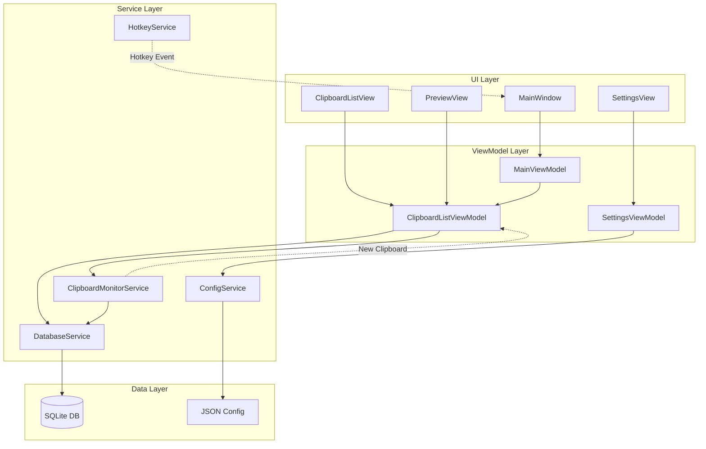
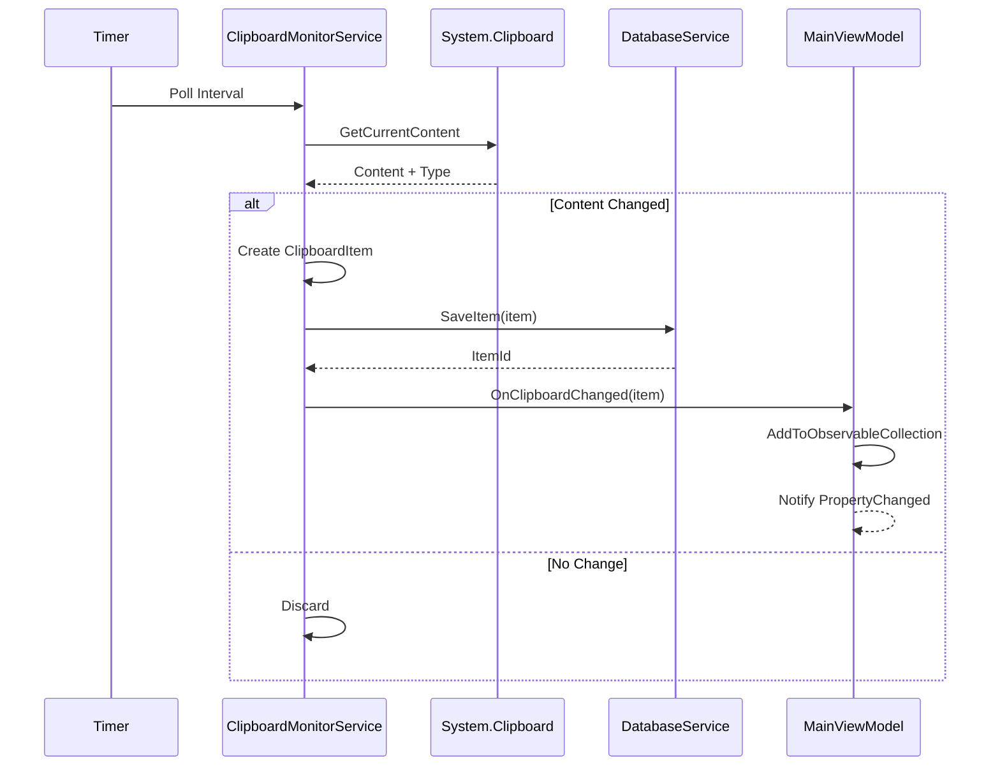

# Clipboard Manager Application - WPF Implementation Plan
## DittoMeOff - Windows Native Clipboard Manager

---

## Project Overview

A Windows clipboard manager application built with WPF (.NET) that keeps a history of clipboard contents, is user-configurable, supports global hotkeys, and provides a modern UI to browse and manage clipboard history.

**Target Platform**: Windows 10/11 (x64)
**.NET Version**: .NET 10.0 (Latest)

---

## Technology Stack Conversion

| Original (Electron) | WPF Equivalent |
|---------------------|-----------------|
| Electron | .NET 8.0 WPF |
| TypeScript | C# 12 |
| React | XAML + MVVM |
| better-sqlite3 | SQLite via Microsoft.Data.Sqlite |
| electron-builder | dotnet publish / MSIX |
| IPC (Inter-Process) | .NET Events / Commands |
| React state | INotifyPropertyChanged / ObservableCollection |

---

## Project Structure (MVVM)

```
DittoMeOff/
├── DittoMeOff.sln
├── src/
│   └── DittoMeOff/
│       ├── App.xaml                    # Application entry point
│       ├── App.xaml.cs
│       ├── MainWindow.xaml             # Main window
│       ├── MainWindow.xaml.cs
│       ├── Models/
│       │   ├── ClipboardItem.cs        # Clipboard entry model
│       │   ├── AppConfig.cs            # Configuration model
│       │   └── Enums.cs                # ContentType, Theme enum
│       ├── ViewModels/
│       │   ├── ViewModelBase.cs        # INotifyPropertyChanged base
│       │   ├── MainViewModel.cs        # Main window logic
│       │   ├── ClipboardListViewModel.cs
│       │   ├── ClipboardItemViewModel.cs
│       │   ├── SettingsViewModel.cs
│       │   └── PreviewViewModel.cs
│       ├── Views/
│       │   ├── ClipboardListView.xaml
│       │   ├── ClipboardItemView.xaml
│       │   ├── SearchBarView.xaml
│       │   ├── PreviewView.xaml
│       │   └── SettingsView.xaml
│       ├── Services/
│       │   ├── ClipboardMonitorService.cs    # Clipboard watching
│       │   ├── HotkeyService.cs              # Global hotkey registration
│       │   ├── DatabaseService.cs            # SQLite operations
│       │   ├── ConfigService.cs              # Settings management
│       │   └── WindowService.cs              # Window management
│       ├── Converters/
│       │   ├── ContentTypeToIconConverter.cs
│       │   ├── TimestampToStringConverter.cs
│       │   └── BoolToVisibilityConverter.cs
│       ├── Helpers/
│       │   ├── NativeMethods.cs              # P/Invoke declarations
│       │   └── GlobalHotkey.cs               # Hotkey helper
│       ├── Resources/
│       │   ├── Styles.xaml                   # Global styles
│       │   ├── Colors.xaml                   # Color resources
│       │   └── Icons/                        # Vector icons
│       └── Assets/
│           └── app.ico
├── src/
│   └── DittoMeOff.Core/                       # Shared core library (optional)
│       └── Models/
│           └── SharedModels.cs
└── README.md
```

---

## Core Features (WPF Implementation)

### 1. Clipboard Monitoring Service

**Original**: `clipboard-monitor.ts` (Node.js)

**WPF Implementation** - [`Services/ClipboardMonitorService.cs`](src/DittoMeOff/Services/ClipboardMonitorService.cs)

```csharp
public class ClipboardMonitorService : IDisposable
{
    // Uses System.Windows.Clipboard with timer polling
    // or Windows hook for clipboard changes
    
    // Captures: Text, Images (BitmapSource), FileDrop lists
    // Stores with timestamp to SQLite database
}
```

**Key Responsibilities**:
- Poll clipboard at configurable intervals (default: 500ms)
- Detect changes via clipboard sequence number
- Capture text, images, and file paths
- Emit events for new clipboard content
- Respect excluded applications setting

### 2. Global Hotkey System

**Original**: `hotkey-manager.ts` (Node.js)

**WPF Implementation** - [`Services/HotkeyService.cs`](src/DittoMeOff/Services/HotkeyService.cs)

```csharp
public class HotkeyService : IDisposable
{
    // Uses RegisterHotKey/UnregisterHotKey Win32 APIs
    // Default: Ctrl+Shift+V
    // Fires event when hotkey pressed
    // Shows/hides main window
}
```

**Implementation**:
- P/Invoke `user32.dll` for `RegisterHotKey`
- Handle `WM_HOTKEY` message via HwndSource
- Configurable modifier keys (Ctrl, Alt, Shift, Win)
- Configurable virtual key

### 3. Clipboard History UI

**Original**: React components

**WPF Implementation**:

| React Component | WPF XAML/Control |
|-----------------|------------------|
| ClipboardList | ListView with DataTemplate |
| ClipboardItem | UserControl / DataTemplate |
| SearchBar | TextBox with binding |
| Settings | UserControl / Flyout |
| Preview | ContentControl with template |

#### Main Window - [`MainWindow.xaml`](src/DittoMeOff/MainWindow.xaml)

```xaml
<Window>
    <Grid>
        <Grid.RowDefinitions>
            <RowDefinition Height="Auto"/>
            <RowDefinition Height="*"/>
            <RowDefinition Height="Auto"/>
        </Grid.RowDefinitions>
        
        <!-- Search Bar -->
        <TextBox x:Name="SearchBox" .../>
        
        <!-- Clipboard List -->
        <ListView x:Name="ClipboardListView" ...>
            <ListView.ItemTemplate>
                <DataTemplate>
                    <!-- Clipboard Item Template -->
                </DataTemplate>
            </ListView.ItemTemplate>
        </ListView>
        
        <!-- Status Bar -->
        <StatusBar Grid.Row="2">
            <TextBlock x:Name="ItemCount"/>
        </StatusBar>
    </Grid>
</Window>
```

### 4. Configuration System

**Original**: JSON config file in Electron

**WPF Implementation** - [`Services/ConfigService.cs`](src/DittoMeOff/Services/ConfigService.cs)

```csharp
public class ConfigService
{
    // Uses JSON file in AppData/Local/DittoMeOff
    // Serializes AppConfig class
    // IOptions pattern for DI
}
```

---

## Data Models

### ClipboardItem - [`Models/ClipboardItem.cs`](src/DittoMeOff/Models/ClipboardItem.cs)

```csharp
public class ClipboardItem
{
    public long Id { get; set; }
    public string Content { get; set; }           // Text content or image path
    public ContentType ContentType { get; set; }  // Text, Image, File, Html
    public DateTime Timestamp { get; set; }
    public bool IsPinned { get; set; }
    public string? AppSource { get; set; }        // Source application
    public long Size { get; set; }                // Content size in bytes
    public string? PreviewText { get; set; }       // First 100 chars for display
    public byte[]? ImageData { get; set; }        // PNG bytes for images
}
```

### ContentType Enum - [`Models/Enums.cs`](src/DittoMeOff/Models/Enums.cs)

```csharp
public enum ContentType
{
    Text,
    Image,
    File,
    Html
}
```

### AppConfig - [`Models/AppConfig.cs`](src/DittoMeOff/Models/AppConfig.cs)

```csharp
public class AppConfig
{
    public int MaxHistoryCount { get; set; } = 100;
    public string Hotkey { get; set; } = "Ctrl+Shift+V";
    public bool AutoStart { get; set; } = false;
    public Theme Theme { get; set; } = Theme.System;
    public long MaxItemSize { get; set; } = 10 * 1024 * 1024; // 10MB
    public List<string> ExcludedApps { get; set; } = new();
    public int ClipboardPollInterval { get; set; } = 500; // ms
}

public enum Theme
{
    Light,
    Dark,
    System
}
```

---

## Database Schema

**Original**: SQLite via better-sqlite3

**WPF Implementation** - [`Services/DatabaseService.cs`](src/DittoMeOff/Services/DatabaseService.cs)

```sql
CREATE TABLE IF NOT EXISTS ClipboardItems (
    Id INTEGER PRIMARY KEY AUTOINCREMENT,
    Content TEXT NOT NULL,
    ContentType INTEGER NOT NULL,
    Timestamp INTEGER NOT NULL,
    IsPinned INTEGER DEFAULT 0,
    AppSource TEXT,
    Size INTEGER NOT NULL,
    PreviewText TEXT,
    ImageData BLOB
);

CREATE INDEX IF NOT EXISTS idx_timestamp ON ClipboardItems(Timestamp DESC);
CREATE INDEX IF NOT EXISTS idx_pinned ON ClipboardItems(IsPinned);
```

---

## UI/UX Design (WPF)

### Main Window Design

```
┌─────────────────────────────────────────┐
│ [🔍 Search...]                    [⚙️] [×]│
├─────────────────────────────────────────┤
│ 📋 Text item preview here...    12:34 PM │
│    Source: Notepad.exe                  │
├─────────────────────────────────────────┤
│ 🖼️ [Image Thumbnail]            12:30 PM │
│    Image 800x600                        │
├─────────────────────────────────────────┤
│ 📁 C:\Users\File.txt            12:28 PM │
│    File path                            │
├─────────────────────────────────────────┤
│ ... more items ...                      │
├─────────────────────────────────────────┤
│ 42 items in history                     │
└─────────────────────────────────────────┘
```

### Window Properties

- **Style**: Borderless with custom title bar or standard window with minwidth
- **Size**: 450px width × 600px height (resizable, min 350×400)
- **Position**: Remember last position, default to screen center
- **Behavior**: Show on hotkey, hide to tray on close

### Settings Panel

Implemented as a popup/flyout or separate tab:

```xaml
<TabControl>
    <TabItem Header="General">
        <!-- Max history count slider -->
        <!-- Auto-start checkbox -->
        <!-- Poll interval -->
    </TabItem>
    <TabItem Header="Hotkeys">
        <!-- Hotkey recorder control -->
    </TabItem>
    <TabItem Header="Storage">
        <!-- Database location -->
        <!-- Clear history button -->
    </TabItem>
    <TabItem Header="Exclusions">
        <!-- Excluded apps list -->
    </TabItem>
</TabControl>
```

### Visual Style

- **Theme**: Follows Windows system theme (light/dark)
- **Accent**: Uses Windows accent color
- **Fonts**: Segoe UI (system font)
- **Animations**: Subtle fade for show/hide
- **Icons**: Segoe MDL2 Assets or custom vector icons

---

## System Integration

### System Tray

```csharp
// NotifyIcon for system tray
var notifyIcon = new NotifyIcon
{
    Icon = new Icon("app.ico"),
    Text = "DittoMeOff"
};
notifyIcon.Click += (s, e) => ShowMainWindow();
```

**Tray Menu**:
- Show Window
- Settings
- ---
- Exit

### Auto-Start

Uses Registry key:
```
HKCU\Software\Microsoft\Windows\CurrentVersion\Run
```

### Window Chrome Options

```xaml
<Window WindowStyle="None"
        AllowsTransparency="True"
        Background="Transparent">
    <!-- Custom title bar for frameless look OR -->
</Window>

<!-- Alternative: Standard window -->
<Window WindowStyle="SingleBorderWindow"
        ResizeMode="CanResizeWithGrip">
```

---

## Key Dependencies (NuGet Packages)

```xml
<PackageReference Include="CommunityToolkit.Mvvm" Version="8.2.2" />
<PackageReference Include="Microsoft.Data.Sqlite" Version="8.0.0" />
<PackageReference Include="Newtonsoft.Json" Version="13.0.3" />
<PackageReference Include="Hardcodet.NotifyIcon.Wpf" Version="1.1.0" />
```

### Package Explanations

| Package | Purpose |
|---------|---------|
| CommunityToolkit.Mvvm | MVVM helpers (ObservableProperty, RelayCommand) |
| Microsoft.Data.Sqlite | SQLite database access |
| Newtonsoft.Json | JSON serialization for config |
| Hardcodet.NotifyIcon.Wpf | System tray integration |

---

## Implementation Phases

### Phase 1: Core Infrastructure
1. Create WPF project with .NET 8
2. Set up project structure (MVVM folders)
3. Implement Models (ClipboardItem, AppConfig)
4. Set up SQLite database service
5. Basic MainWindow shell

### Phase 2: Clipboard Monitoring
1. Implement ClipboardMonitorService
2. Test clipboard capture (text, images, files)
3. Integrate with database storage
4. Add polling with change detection

### Phase 3: UI Development
1. Create ClipboardItem DataTemplate
2. Build ClipboardListView with ListView
3. Implement search/filter functionality
4. Add preview pane for selected item
5. Create settings panel UI

### Phase 4: System Integration
1. Implement global hotkey service
2. Add system tray icon
3. Configure auto-start via registry
4. Window positioning and persistence
5. Hide to tray on close

### Phase 5: Polish & Distribution
1. Theme support (light/dark/system)
2. Configuration persistence
3. Build release executable
4. Application packaging (installer or portable)

---

## Mermaid Diagram: Architecture Overview



---

## Mermaid Diagram: Clipboard Capture Flow



---

## Build Configuration

### Project File (DittoMeOff.csproj)

```xml
<Project Sdk="Microsoft.NET.Sdk">
  <PropertyGroup>
    <OutputType>WinExe</OutputType>
    <TargetFramework>net10.0-windows</TargetFramework>
    <UseWPF>true</UseWPF>
    <ApplicationIcon>Assets\app.ico</ApplicationIcon>
    <AssemblyName>DittoMeOff</AssemblyName>
    <RootNamespace>DittoMeOff</RootNamespace>
    <Version>1.0.0</Version>
    <Authors>DittoMeOff Team</Authors>
    <Description>Windows Clipboard Manager</Description>
    <PublishSingleFile>true</PublishSingleFile>
    <SelfContained>true</SelfContained>
    <RuntimeIdentifier>win-x64</RuntimeIdentifier>
    <IncludeNativeLibrariesForSelfExtract>true</IncludeNativeLibrariesForSelfExtract>
  </PropertyGroup>
  
  <ItemGroup>
    <PackageReference Include="CommunityToolkit.Mvvm" Version="8.2.2" />
    <PackageReference Include="Microsoft.Data.Sqlite" Version="8.0.0" />
    <PackageReference Include="Newtonsoft.Json" Version="13.0.3" />
    <PackageReference Include="Hardcodet.NotifyIcon.Wpf" Version="1.1.0" />
  </ItemGroup>
</Project>
```

---

## Key WPF Patterns Used

| Pattern | Implementation |
|---------|----------------|
| MVVM | ViewModelBase + RelayCommand from CommunityToolkit |
| Dependency Injection | Manual DI in App.xaml.cs or Microsoft.Extensions.DependencyInjection |
| Data Binding | Two-way bindings in XAML |
| Commands | ICommand / RelayCommand |
| Observable Collections | ObservableCollection<T> for lists |
| Property Notification | INotifyPropertyChanged |
| Resources | XAML ResourceDictionary for styles |

---

## Testing Strategy

1. **Unit Tests**: ViewModel logic, Service methods
2. **Integration Tests**: Database operations, Clipboard capture
3. **UI Tests**: Manual testing with various clipboard content types
4. **Hotkey Tests**: Verify global hotkey registration on different Windows versions

---

## Deployment Options

1. **Portable**: Single .exe file (self-contained)
2. **Installer**: MSIX or InnoSetup installer
3. **Store**: MSIX package for Microsoft Store

---

## Conversion Summary

| Original Concept | WPF Equivalent |
|-----------------|----------------|
| Electron Main Process | App.xaml.cs + Services |
| Electron Renderer | XAML Views + ViewModels |
| React useState | ObservableProperty |
| React useEffect | Loaded event, PropertyChanged |
| IPC | .NET Events / Commands |
| better-sqlite3 | Microsoft.Data.Sqlite |
| electron-builder | dotnet publish |
| Global Shortcut | RegisterHotKey Win32 API |
| System Tray | Hardcodet.NotifyIcon.Wpf |

---

## Next Steps

1. Create the WPF project using `dotnet new wpf`
2. Add NuGet packages
3. Implement Models
4. Implement Services
5. Build ViewModels
6. Create XAML Views
7. Integrate all components
8. Test and polish
9. Build release executable
