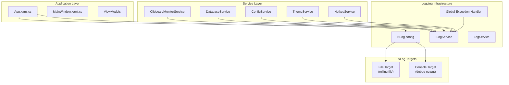

# NLog Logging Architecture for DittoMe-Off

## Overview

This document describes the architecture for implementing structured logging using NLog in the DittoMe-Off WPF clipboard manager application.

## Current State

The application currently uses `System.Diagnostics.Debug.WriteLine` scattered throughout the codebase for basic debugging output. This approach lacks:
- Log levels (Debug, Info, Warning, Error, Fatal)
- Structured logging with context
- Log file rotation and archiving
- Centralized log configuration
- Global exception handling with stack traces

## Architecture Overview



## Components

### 1. NLog NuGet Package

**Package:** `NLog` (latest stable version ~5.x)

**Installation:**
```xml
<PackageReference Include="NLog" Version="5.3.4" />
```

### 2. NLog Configuration File

File: `src/DittoMe-Off/NLog.config`

```xml
<?xml version="1.0" encoding="utf-8" ?>
<nlog xmlns="http://www.nlog-project.org/schemas/NLog.xsd"
      xmlns:xsi="http://www.w3.org/2001/XMLSchema-instance"
      autoReload="true"
      throwExceptions="false">

  <variable name="logDirectory" value="${specialfolder:folder=LocalApplicationData}/DittoMe-Off/Logs" />
  <variable name="logFileName" value="DittoMe-Off" />

  <targets>
    <!-- Rolling file target -->
    <target name="fileTarget"
            xsi:type="File"
            fileName="${logDirectory}/${logFileName}.log"
            layout="${longdate} | ${level:uppercase=true:padding=-5} | ${logger} | ${message} ${exception:format=tostring}"
            archiveFileName="${logDirectory}/archives/${logFileName}.{#}.log"
            archiveEvery="Day"
            archiveNumbering="Date"
            maxArchiveFiles="7"
            concurrentWrites="true"
            keepFileOpen="false"
            encoding="utf-8" />

    <!-- Debug console target (visible in VS output window) -->
    <target name="debuggerTarget"
            xsi:type="Debugger"
            layout="${time} | ${level:uppercase=true:padding=-5} | ${message} ${exception:format=tostring}" />
  </targets>

  <rules>
    <!-- Debug builds: all logs to file and debugger -->
    <logger name="*" minlevel="Debug" writeTo="fileTarget" />
    <logger name="*" minlevel="Debug" writeTo="debuggerTarget" />
  </rules>
</nlog>
```

### 3. ILogService Interface

File: `src/DittoMe-Off/Services/ILogService.cs`

```csharp
namespace DittoMeOff.Services;

public interface ILogService
{
    void Debug(string message, params object[] args);
    void Info(string message, params object[] args);
    void Warn(string message, params object[] args);
    void Error(string message, Exception? exception = null, params object[] args);
    void Fatal(string message, Exception? exception = null, params object[] args);
    
    // Structured logging with named properties
    void Debug(string message, Dictionary<string, object>? properties = null);
    void Info(string message, Dictionary<string, object>? properties = null);
    void Warn(string message, Dictionary<string, object>? properties = null);
    void Error(string message, Exception? exception = null, Dictionary<string, object>? properties = null);
    void Fatal(string message, Exception? exception = null, Dictionary<string, object>? properties = null);
}
```

### 4. LogService Implementation

File: `src/DittoMe-Off/Services/LogService.cs`

```csharp
using NLog;

namespace DittoMeOff.Services;

public class LogService : ILogService
{
    private static readonly Logger _logger = LogManager.GetCurrentClassLogger();

    public void Debug(string message, params object[] args)
    {
        _logger.Debug(message, args);
    }

    public void Info(string message, params object[] args)
    {
        _logger.Info(message, args);
    }

    public void Warn(string message, params object[] args)
    {
        _logger.Warn(message, args);
    }

    public void Error(string message, Exception? exception = null, params object[] args)
    {
        if (exception != null)
            _logger.Error(exception, message, args);
        else
            _logger.Error(message, args);
    }

    public void Fatal(string message, Exception? exception = null, params object[] args)
    {
        if (exception != null)
            _logger.Fatal(exception, message, args);
        else
            _logger.Fatal(message, args);
    }

    public void Debug(string message, Dictionary<string, object>? properties = null)
    {
        LogWithProperties(LogLevel.Debug, message, null, properties);
    }

    public void Info(string message, Dictionary<string, object>? properties = null)
    {
        LogWithProperties(LogLevel.Info, message, null, properties);
    }

    public void Warn(string message, Dictionary<string, object>? properties = null)
    {
        LogWithProperties(LogLevel.Warn, message, null, properties);
    }

    public void Error(string message, Exception? exception = null, Dictionary<string, object>? properties = null)
    {
        LogWithProperties(LogLevel.Error, message, exception, properties);
    }

    public void Fatal(string message, Exception? exception = null, Dictionary<string, object>? properties = null)
    {
        LogWithProperties(LogLevel.Fatal, message, exception, properties);
    }

    private void LogWithProperties(LogLevel level, string message, Exception? exception, Dictionary<string, object>? properties)
    {
        var logEvent = _logger.Factory.CreateLogEvent(level, message, exception);
        
        if (properties != null)
        {
            foreach (var kvp in properties)
            {
                logEvent.Properties[kvp.Key] = kvp.Value;
            }
        }
        
        _logger.Log(logEvent);
    }
}
```

### 5. Global Exception Handler

File: `src/DittoMe-Off/Services/GlobalExceptionHandler.cs`

```csharp
using System.Windows;
using System.Windows.Threading;
using NLog;

namespace DittoMeOff.Services;

public static class GlobalExceptionHandler
{
    private static readonly Logger _logger = LogManager.GetCurrentClassLogger();

    public static void Initialize(Application application)
    {
        // Handle UI thread exceptions
        application.DispatcherUnhandledException += OnDispatcherUnhandledException;
        
        // Handle non-UI thread exceptions
        AppDomain.CurrentDomain.UnhandledException += OnUnhandledException;
        
        // Handle task scheduler exceptions
        TaskScheduler.UnobservedTaskException += OnUnobservedTaskException;
        
        _logger.Info("Global exception handlers initialized");
    }

    private static void OnDispatcherUnhandledException(object sender, DispatcherUnhandledExceptionEventArgs e)
    {
        _logger.Fatal(e.Exception, "Unhandled UI thread exception");
        e.Handled = true;
        
        MessageBox.Show(
            $"An unexpected error occurred: {e.Exception.Message}\n\nThe application will continue running.",
            "Error",
            MessageBoxButton.OK,
            MessageBoxImage.Error);
    }

    private static void OnUnhandledException(object sender, UnhandledExceptionEventArgs e)
    {
        var exception = e.ExceptionObject as Exception;
        _logger.Fatal(exception, "Unhandled non-UI thread exception");
        
        if (e.IsTerminating)
        {
            _logger.Fatal("Application is terminating due to unhandled exception");
            LogManager.Shutdown();
        }
    }

    private static void OnUnobservedTaskException(object? sender, UnobservedTaskExceptionEventArgs e)
    {
        _logger.Error(e.Exception, "Unobserved task exception");
        e.SetObserved();
    }
}
```

## Dependency Injection Integration

Update `App.xaml.cs` to register logging services:

```csharp
using NLog;

protected override void OnStartup(StartupEventArgs e)
{
    // Initialize NLog early
    var configPath = Path.Combine(AppDomain.CurrentDomain.BaseDirectory, "NLog.config");
    LogManager.Configuration = new NLog.Config.XmlLoggingConfiguration(configPath);
    
    // Set up global exception handling
    GlobalExceptionHandler.Initialize(this);
    
    base.OnStartup(e);
    
    // ... rest of startup code
}

private void ConfigureServices(IServiceCollection services)
{
    // Register logging services
    services.AddSingleton<ILogService, LogService>();
    
    // ... rest of service registrations
}

protected override void OnExit(ExitEventArgs e)
{
    // Flush and shutdown NLog
    LogManager.Shutdown();
    base.OnExit(e);
}
```

## Logging Usage Examples

### Basic Logging

```csharp
public class ClipboardMonitorService : IClipboardMonitorService
{
    private readonly ILogService _log;

    public ClipboardMonitorService(IConfigService configService, IDatabaseService databaseService, ILogService logService)
    {
        _configService = configService;
        _databaseService = databaseService;
        _log = logService;
    }

    public void Start()
    {
        _log.Debug("Starting clipboard monitoring");
        // ...
        _log.Info("Clipboard monitoring started with poll interval: {PollInterval}ms", 
            _configService.Config.ClipboardPollInterval);
    }
}
```

### Structured Logging with Context

```csharp
public void InsertItem(ClipboardItem item)
{
    _log.Info("Clipboard item captured", new Dictionary<string, object>
    {
        ["ContentType"] = item.ContentType.ToString(),
        ["Size"] = item.Size,
        ["SourceApp"] = item.AppSource ?? "Unknown"
    });
    
    try
    {
        // Database operation
        _log.Debug("Inserting item into database");
    }
    catch (Exception ex)
    {
        _log.Error("Failed to insert clipboard item", ex, new Dictionary<string, object>
        {
            ["ContentType"] = item.ContentType.ToString(),
            ["Size"] = item.Size
        });
        throw;
    }
}
```

### Log Categories by Service

| Service | Recommended Log Level | Key Events |
|---------|----------------------|------------|
| ClipboardMonitorService | Debug/Info | Monitoring started/stopped, clipboard captured |
| DatabaseService | Debug/Warn | Query execution, connection issues |
| ConfigService | Info | Configuration loaded, saved |
| ThemeService | Debug | Theme applied, theme list loaded |
| HotkeyService | Debug/Info | Hotkey registered, hotkey pressed |

## File: `src/DittoMe-Off/DittoMeOff.csproj` Changes

Add the NLog package reference:

```xml
<ItemGroup>
  <PackageReference Include="NLog" Version="5.3.4" />
  <!-- existing packages -->
</ItemGroup>
```

Add the NLog.config to be copied to output:

```xml
<ItemGroup>
  <Content Include="NLog.config">
    <CopyToOutputDirectory>PreserveNewest</CopyToOutputDirectory>
  </Content>
</ItemGroup>
```

## Build Configuration Considerations

### Debug Build
- Log level: Debug (all logs enabled)
- Both file and debugger targets active
- Full exception stack traces

### Release Build
- Log level: Info (less verbose)
- File target only
- Exception messages only (no stack traces in message, still in log file)

Modify the `rules` section in NLog.config based on build:

```xml
<rules>
    <!-- File logging - always active -->
    <logger name="*" minlevel="Debug" writeTo="fileTarget" />
    
    <!-- Debugger logging - Debug builds only -->
    <logger name="*" minlevel="Debug" writeTo="debuggerTarget" />
</rules>
```

## Migration Checklist

1. [ ] Add NLog NuGet package to `DittoMeOff.csproj`
2. [ ] Create `NLog.config` in project root
3. [ ] Create `Services/ILogService.cs` interface
4. [ ] Create `Services/LogService.cs` implementation
5. [ ] Create `Services/GlobalExceptionHandler.cs`
6. [ ] Update `App.xaml.cs`:
   - Initialize NLog configuration
   - Register `ILogService` in DI container
   - Set up global exception handlers
   - Add NLog shutdown on exit
7. [ ] Update `NLog.config` to copy to output directory in csproj
8. [ ] Update each service to use `ILogService` instead of `Debug.WriteLine`
9. [ ] Remove all `System.Diagnostics.Debug.WriteLine` calls
10. [ ] Test logging in each service

## Log File Location

Logs are stored in: `%LOCALAPPDATA%\DittoMe-Off\Logs\`

File naming: `DittoMe-Off.log` (rolling daily)
Archive naming: `DittoMe-Off.2024-01-15.log`

## Security Considerations

1. **PII Handling**: Do not log clipboard content directly
2. **Sanitization**: If logging clipboard content is absolutely necessary, truncate and mask sensitive patterns
3. **Log Rotation**: 7-day retention with daily archiving
4. **File Permissions**: Log directory inherits NTFS permissions from `%LOCALAPPDATA%`

## Performance Considerations

1. **Async Wrapper**: NLog handles async writes internally via `concurrentWrites="true"`
2. **Buffering**: File target uses buffering for performance
3. **Keep File Open**: Set to `false` to allow log rotation without file locks
