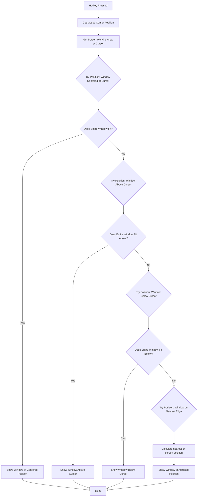

# Window Positioning Plan - Mouse-Centered with Screen Boundary Awareness

## Current Implementation Analysis

The current [`ShowWindow()`](src/DittoMe-Off/MainWindow.xaml.cs:388) method:
- Gets cursor position via `System.Windows.Forms.Cursor.Position`
- Sets `Left = cursorPos.X` and `Top = cursorPos.Y` (window's **top-left corner** at cursor)
- Calls `EnsureWindowOnScreen()` which adjusts if off-screen
- Uses `SetWindowPos` to force position after showing

**Issues with current approach:**
1. Window's top-left corner is at cursor, so with typical 400x600 window, most of it appears to the **lower-right** of cursor
2. `EnsureWindowOnScreen` only makes minimal adjustments (push left if too far right, push up if too far down)
3. If cursor is near screen edges, window may be pushed in unexpected ways
4. No consideration of **which edge** is closest to cursor when repositioning

---

## Proposed Solution

### Design Goals

1. **Center at cursor** - Position window center at mouse cursor point
2. **Smart fallback hierarchy** - Try multiple positions in order of preference
3. **Full visibility guarantee** - Window must be completely on-screen
4. **Prefer natural placement** - Keep window near cursor when possible

### Positioning Strategy Flowchart



### Implementation Steps

#### Step 1: Add P/Invoke for GetCursorPos
Add Windows API to get cursor position in screen coordinates:
```csharp
[DllImport("user32.dll")]
private static extern bool GetCursorPos(out POINT lpPoint);
```

#### Step 2: Create Smart Positioning Method
Replace `ShowWindow()` with a new method that:
1. Gets cursor position via `GetCursorPos` (more reliable)
2. Calculates window bounds with window **centered** at cursor
3. Tests if window fits at cursor position
4. If not, applies fallback hierarchy: above → below → nearest edge

#### Step 3: Improve `EnsureWindowOnScreen` Logic
Enhanced method to handle edge cases:
1. Find which screen contains the cursor
2. Calculate maximum bounds respecting all screen edges
3. Apply repositioning based on which edge cursor is closest to

### Proposed Method Signatures

```csharp
/// <summary>
/// Positions window centered at cursor with screen boundary enforcement
/// </summary>
private void PositionWindowAtCursor()

/// <summary>
/// Tests if window at given position fits within screen bounds
/// </summary>
private bool DoesWindowFitOnScreen(double left, double top, double width, double height, Rect screenBounds)

/// <summary>
/// Gets the optimal screen for cursor position
/// </summary>
private Rect GetScreenBoundsForCursor()
```

### Positioning Fallback Hierarchy

| Priority | Position | When Used |
|----------|----------|-----------|
| 1 | Centered at cursor | Window fits entirely at cursor position |
| 2 | Above cursor | Not enough room below, but fits above |
| 3 | Below cursor | Not enough room above or below center |
| 4 | Nearest edge | Window too large for both above/below |

### Edge Case Handling

1. **Cursor near top of screen**: Position window below cursor instead of centering
2. **Cursor near bottom**: Position window above cursor
3. **Cursor near corners**: Prefer horizontal adjustment over vertical
4. **Multi-monitor**: Use the screen where cursor is located
5. **Taskbar presence**: `GetScreenWorkingArea` already excludes taskbar

---

## File Changes

### Primary Change: `src/DittoMe-Off/MainWindow.xaml.cs`

1. **Add P/Invoke**: `GetCursorPos` and `POINT` struct
2. **Modify `ShowWindow()`**: Call new positioning method instead of current cursor positioning
3. **Add `PositionWindowAtCursor()`**: New smart positioning with fallback hierarchy
4. **Add `DoesWindowFitOnScreen()`**: Bounds checking helper
5. **Add `GetPreferredPosition()`**: Calculates position based on fallback hierarchy
6. **Keep `EnsureWindowOnScreen()`**: Final safety check before rendering

---

## Implementation Order

1. Add P/Invoke declarations for `GetCursorPos`
2. Create `DoesWindowFitOnScreen()` helper method
3. Create `PositionWindowAtCursor()` main positioning logic
4. Modify `ShowWindow()` to use new positioning method
5. Test with cursor at various screen positions and edge cases
